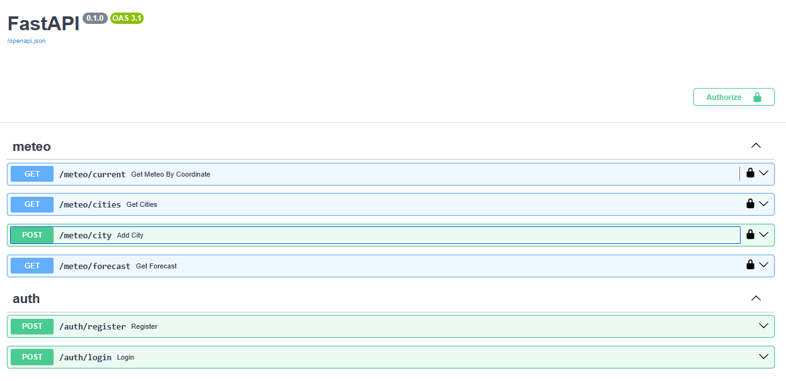
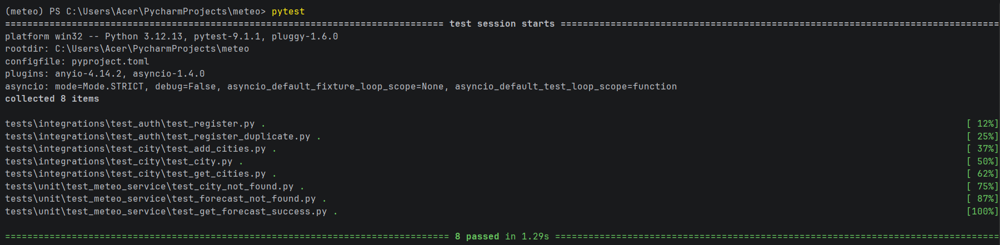

# Meteo API

Описание проекта

## Стек

- Python 3.12
- FastAPI
- SQLAlchemy
- PostgreSQL
- Alembic
- PyJWT
- Pytest

## Возможности

- Регистрация
- Авторизация
- Добавление города
- Получение прогноза
- Получение списка городов
- Unit и integration тесты

## Запуск
```shell
git clone https://github.com/alexandrwrks/meteo

uv venv

uv sync

alembic upgrade head

uvicorn script:app --port 8000 --host 127.0.0.1 --reload
```
## Альтернативный запуск
```shell
python script.py
```

## Запуск тестов
```shell
pytest
```

## API




## Тесты

